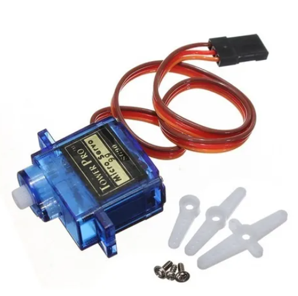
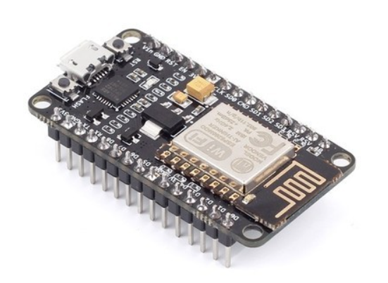
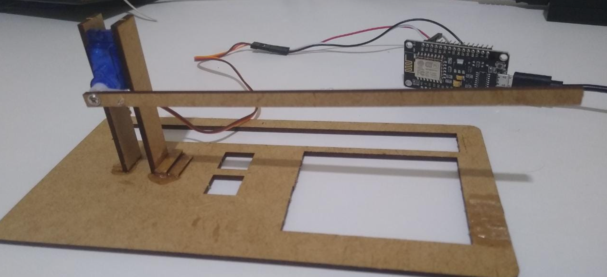

<h1>Utilizando Nodemcu e Servo Motor 9g para abrir e fechar a cancela de uma maquete</h1>
 

<h4>Servo Motor 9g</h4>

 

<h4>NodeMCU</h4>

 

<h4>Cancela em MDF</h4>

 

<h4>Endpoints</h4>
<ul>
    <li>/abrir</li>
    <li>/fechar</li>
    <li>/status</li>
</ul>